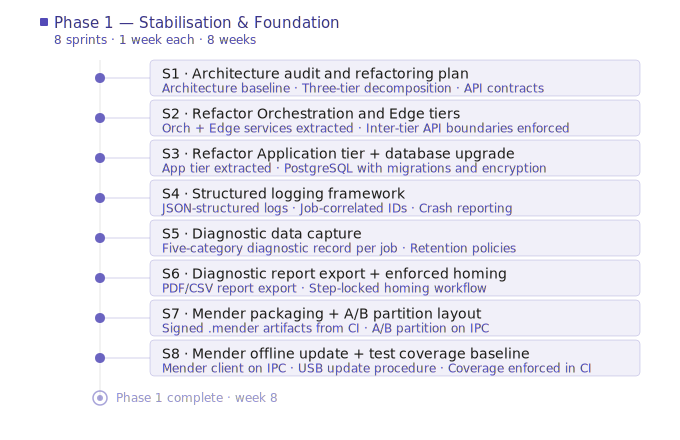

# Stratum Platform — Sprint Plan: Phase 1

## Overview

**Phase goal:** Make the existing system reliable, observable, and updateable. No new end-user features.
**Sprint length:** 1 week
**Sprints:** 1–8 (8 weeks)

Sprint estimates assume a consistent team velocity and are intended as a planning baseline. Dependencies between sprints are noted where a sprint cannot begin until a prior sprint's output is available.

---

### Sprint 1 — Architecture Audit and Refactoring Plan

**Goal:** Establish a clear, agreed architectural baseline before any code changes are made. This sprint is entirely preparatory — no production code is changed.

**Deliverables:**
- Documented current architecture: responsibilities of each package, data flows across components, and known coupling points
- Proposed three-tier decomposition: mapping of current packages to Orchestration, Edge, and Application tiers
- Defined inter-tier API contracts: interface specifications for all cross-tier communication boundaries
- Refactoring execution plan: sequenced list of changes with dependency order and risk assessment

**Tasks:**
- Audit `dcrafter_print_service` and document all responsibilities currently bundled within it
- Audit `dcrafter_control_service`, `cc_print_server`, `dcrafter_controller`, and `dcrafter_bringup` for cross-cutting concerns and implicit couplings
- Identify all existing cross-package data flows and communication patterns
- Draft the three-tier service decomposition and circulate for team review
- Define API contracts for Orchestration ↔ Edge and Application ↔ Orchestration boundaries
- Produce a sequenced refactoring plan with explicit dependency order

**Depends on:** —

---

### Sprint 2 — Architecture Refactoring (Orchestration and Edge Tiers)

**Goal:** Decompose the backend into clearly bounded Orchestration-tier and Edge-tier services with explicit inter-tier interfaces.

**Deliverables:**
- Orchestration-tier services extracted: project management, toolpath pipeline orchestration, job lifecycle management
- Edge-tier services extracted: machine control, motion execution, sensor feedback, local task queue
- All cross-tier communication passing through defined API boundaries
- Existing operator workflows verified as unbroken on the refactored codebase

**Tasks:**
- Extract project management and job lifecycle responsibilities from `dcrafter_print_service` into a new Orchestration-tier service
- Extract toolpath pipeline orchestration from `cc_print_server` into its own Orchestration-tier service boundary
- Isolate Edge-tier responsibilities in `dcrafter_controller`: machine control, motion execution, local task queue
- Implement inter-tier API contracts defined in Sprint 1
- Update `dcrafter_bringup` to launch the decomposed services
- Run the full existing operator workflow (enable → home → create project → scan → print) against the refactored codebase and verify no regressions

**Depends on:** Sprint 1

---

### Sprint 3 — Architecture Refactoring (Application Tier) and Database Upgrade

**Goal:** Complete the three-tier refactoring by extracting the Application Tier, and replace SQLite with PostgreSQL.

**Deliverables:**
- Application-tier API gateway and serving layer extracted and serving the existing operator UI without behavioural change
- PostgreSQL running as a local container on the IPC with encrypted storage at rest
- Schema migration framework in place (Alembic or Flyway)
- All existing data models and queries migrated to PostgreSQL
- Migration script tested against an existing deployment

**Tasks:**
- Extract the API gateway and serving layer from `dcrafter_control_service` and `dcrafter_print_service` into a dedicated Application-tier service
- Update `dcrafter_gui` to communicate exclusively through the Application-tier API
- Stand up PostgreSQL as a local container in the `dcrafter_bringup` stack
- Enable encrypted storage at rest on the PostgreSQL instance
- Introduce migration framework and write initial migration to reproduce the current schema
- Migrate all data access code from SQLite to PostgreSQL
- Write and test an upgrade migration script that transfers data from an existing SQLite deployment to PostgreSQL
- Update architecture documentation to reflect the completed three-tier structure

**Depends on:** Sprint 2

---

### Sprint 4 — Structured Logging Framework

**Goal:** Introduce structured logging across all services so that every significant event is captured, correlated by job, and queryable.

**Deliverables:**
- Structured logging framework integrated across all Orchestration, Edge, and Application tier services
- JSON-formatted log output with consistent severity levels and job-correlation IDs
- Structured error and crash reporting capturing stack traces and system state at fault time
- Log retention policy configuration in place

**Tasks:**
- Select and integrate a structured logging library across all services (consistent format: JSON, severity levels, timestamps)
- Define and enforce log correlation ID convention: every log entry for a given job carries the same job identifier
- Instrument all Orchestration-tier services: log all job state transitions, pipeline stage entries and exits, and error conditions
- Instrument Edge-tier services: log all machine commands issued, state transitions, and fault conditions
- Instrument Application-tier service: log all API requests and responses at an appropriate verbosity level
- Implement structured crash reporting: on any unhandled exception, capture stack trace, recent log context, and system state and write to a dedicated crash log
- Implement configurable log retention policies and verify they enforce storage bounds

**Depends on:** Sprint 3

---

### Sprint 5 — Diagnostic Data Capture

**Goal:** Capture and store the five diagnostic data categories defined in the Stratum spec for every job, correlated under a shared job identifier.

**Deliverables:**
- Command log captured: every instruction issued to the robot, with timestamp and actor identity
- Execution trace captured: measured robot behaviour in response to commands
- Controller log captured: PMAC internal decisions, fault codes, and compensation values
- Hardware telemetry snapshot captured: sensor readings, servo drive states, fault flags at configurable frequency
- Operator event log captured: structured records of all human-in-the-loop actions
- All five categories stored in PostgreSQL under a shared job identifier
- Configurable per-layer retention policies enforced for all five categories

**Tasks:**
- Define database schema for all five diagnostic data categories; implement migration
- Implement command log capture in the Edge-tier machine control service
- Implement execution trace capture: subscribe to encoder feedback, extrusion output, and task state transition events
- Implement controller log capture: parse and store PMAC fault codes, compensation values, and internal state via `pmac_ssh`
- Implement hardware telemetry snapshot capture: poll sensor readings, servo drive states, temperatures, and voltages at configurable frequency; default to anomaly-windowed capture for high-volume data
- Implement operator event log capture in the Application-tier API: record job acknowledgement, lintel placement confirmations, E-Stop events, and restart confirmations with timestamp, layer index, and operator identity
- Wire all five capture streams to write under a shared job identifier in PostgreSQL
- Implement and verify per-layer retention policy enforcement for each data category

**Depends on:** Sprint 4

---

### Sprint 6 — Diagnostic Report Export and Enforced Homing Workflow

**Goal:** Make diagnostic data accessible to operators via exportable reports, and enforce the homing step sequence to prevent skipped steps.

**Deliverables:**
- Per-job diagnostic report export available in the operator UI (PDF and CSV formats)
- System health summary export available in the operator UI
- Homing workflow enforces strict step sequence in both backend and UI; skipped or out-of-order steps are blocked with a clear error message

**Tasks:**
- Implement a report generation service that assembles per-job diagnostic data (command log, execution trace, operator event log, hardware telemetry summary) into a structured report
- Add PDF and CSV export endpoints to the Application-tier API
- Add export controls to the operator UI: per-job diagnostic report download and system health summary download
- Audit the existing homing workflow in `dcrafter_controller` and `dcrafter_control_service` to identify all step sequence enforcement gaps
- Refactor the homing backend to enforce step sequence: each step is gated on confirmation of the previous step
- Update the homing UI in `dcrafter_gui` to reflect the enforced sequence: show current step clearly, disable out-of-sequence controls, display actionable error messages on violation
- Write integration tests covering: correct sequence completion, attempt to skip a step, attempt to execute out of order

**Depends on:** Sprint 5

---

### Sprint 7 — Mender Packaging and A/B Partition Layout

**Goal:** Produce signed Mender-compatible update artifacts from CI and configure the IPC with the A/B partition layout required for atomic updates and rollback.

**Deliverables:**
- CI/CD pipeline producing a signed `.mender` artifact on every release
- `platform_wizard` updated to provision IPC disks with A/B partition layout
- Signing key infrastructure in place: key generation, storage, and injection into the CI pipeline documented and implemented
- End-to-end packaging pipeline verified: artifact built, signed, and validated

**Tasks:**
- Design A/B partition layout for the IPC disk and document the partition scheme
- Update `platform_wizard` to partition IPC disks with the A/B layout during OS provisioning
- Generate signing key pair; document key storage and rotation procedure
- Integrate Mender Artifact tooling into the CI/CD pipeline: build artifact, embed version metadata, sign with private key
- Update `dcrafter_packaging` to produce `.mender` artifacts instead of the current tarball format
- Write a CI validation step that verifies the artifact can be unpacked and that the embedded signature is valid against the public key
- Verify the full packaging pipeline end-to-end on a test IPC with the new partition layout

**Depends on:** Sprint 3

---

### Sprint 8 — Mender Offline Update Tooling and Test Coverage Baseline

**Goal:** Provision the Mender client on the IPC for verified offline update via USB, and establish a minimum test coverage baseline enforced in CI.

**Deliverables:**
- Mender client provisioned on the IPC with the trusted public key baked in
- Operator-facing USB update procedure documented and tested end-to-end on a real IPC
- Every update application logged locally with version, timestamp, and outcome
- Minimum test coverage threshold defined and enforced in CI
- Unit and integration test coverage expanded across refactored services, with focus on error paths and boundary conditions
- HIL testing strategy document produced

**Tasks:**
- Integrate Mender client into the IPC image built by `platform_wizard`; inject trusted public key at provisioning time
- Write a wrapper script that automates USB mount detection, artifact discovery, and `mender install` invocation
- Test the full offline update workflow end-to-end on a real IPC: copy artifact to USB, plug in, run script, verify update applied, verify rollback on a deliberately broken artifact
- Document the operator update procedure clearly
- Audit current test coverage across all refactored services and identify the highest-risk untested paths
- Write unit tests for error paths and boundary conditions: unsupported IFC features, invalid print configurations, unexpected hardware responses, database migration edge cases
- Configure CI to measure coverage and fail the build below the agreed minimum threshold
- Write the HIL testing strategy document: scope, tooling choices, proposed test categories, and implementation plan for Phase 4

**Depends on:** Sprint 7

---

## Sprint Summary

| Sprint | Week | Title | Key Deliverables |
|---|---|---|---|
| 1 | 1 | Architecture Audit and Refactoring Plan | Architecture baseline, three-tier decomposition, inter-tier API contracts |
| 2 | 2 | Architecture Refactoring (Orchestration and Edge Tiers) | Orchestration and Edge tier services extracted, regressions verified |
| 3 | 3 | Architecture Refactoring (Application Tier) and Database Upgrade | Application tier extracted, PostgreSQL with migrations and encryption |
| 4 | 4 | Structured Logging Framework | JSON-structured logs, crash reporting, retention policies |
| 5 | 5 | Diagnostic Data Capture | Five-category diagnostic record per job, retention policies |
| 6 | 6 | Diagnostic Report Export and Enforced Homing | Report export (PDF/CSV), step-locked homing workflow |
| 7 | 7 | Mender Packaging and A/B Partition Layout | Signed `.mender` artifacts from CI, A/B partition on IPC |
| 8 | 8 | Mender Offline Update Tooling and Test Coverage | Mender client on IPC, USB update procedure, coverage baseline, HIL strategy |
