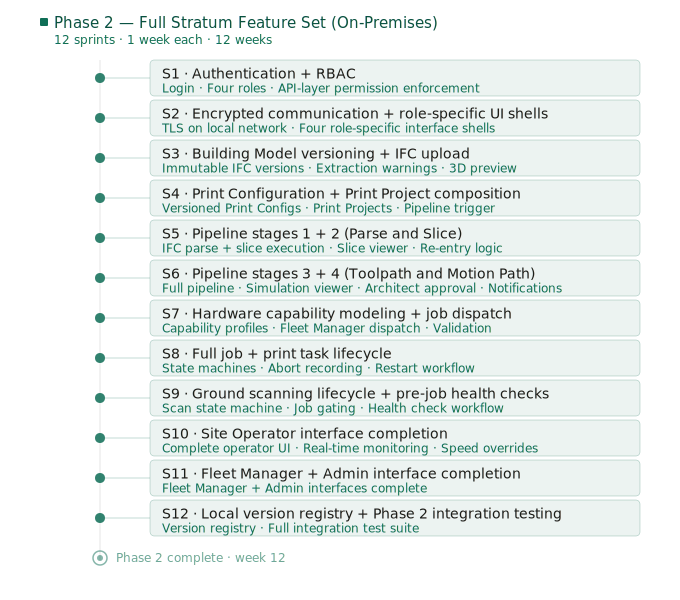

# Stratum Platform — Sprint Plan: Phase 2

## Overview

**Phase goal:** Deliver the complete Stratum feature set with the Orchestration Tier still running on the IPC.
**Sprint length:** 1 week
**Sprints:** 1–12 (12 weeks)

Sprints in this document are numbered from 1. Cross-phase dependencies reference their source phase explicitly (e.g. "Phase 1 Sprint 3").

Sprint estimates assume a consistent team velocity and are intended as a planning baseline.

---

**Phase goal:** Deliver the complete Stratum feature set with the Orchestration Tier still running on the IPC.
**Sprints:** 1–12 (12 weeks)

---

### Sprint 1 — Authentication and RBAC

**Goal:** Introduce authentication and enforce role-based permissions at the API layer across the platform.

**Deliverables:**
- Authentication layer in place: users must log in to access any part of the platform
- Four roles defined with distinct permission sets: Site Operator, Architect / Project Owner, Fleet Manager, Admin
- Permissions enforced at the Application-tier API layer
- Local bootstrap admin account available for fresh IPC setup
- Login UI integrated into `dcrafter_gui`

**Tasks:**
- Select and integrate an authentication library or service (username/password; structure for LDAP/OIDC extension in Phase 3)
- Define permission sets for each role and implement permission enforcement middleware in the Application-tier API
- Implement session management: token issuance on login, expiry, and revocation
- Add login screen to `dcrafter_gui`; redirect unauthenticated requests to login
- Implement local bootstrap admin account creation during first-run setup (via `platform_wizard` or a dedicated init script)
- Write tests covering: login success and failure, access to permitted and forbidden endpoints for each role, token expiry behaviour

**Depends on:** Phase 1 Sprint 3

---

### Sprint 2 — Encrypted Communication and Role-Specific UI Shell

**Goal:** Encrypt all communication on the local robot network and deliver the structural shell of all four role-specific interfaces.

**Deliverables:**
- TLS enabled for all communication between operator devices and the Application-tier API
- Self-signed certificate and private CA generation supported via `platform_wizard`
- Inter-service communication authenticated and encrypted across process boundaries on the IPC
- All four role-specific UI shells in place in `dcrafter_gui`, each routing to the correct backend based on authenticated role: the Site Operator shell routes to the Application Tier only; the Architect, Fleet Manager, and Admin shells route through the Orchestration Tier

**Tasks:**
- Generate and provision TLS certificates via `platform_wizard`; support self-signed CA for on-premises deployments
- Configure the Application-tier API to serve over HTTPS only; redirect HTTP to HTTPS
- Enable mutual TLS or equivalent authentication for inter-service communication within the IPC where it crosses a process boundary
- Refactor `dcrafter_gui` routing to direct each authenticated role to its dedicated interface shell, with the Site Operator shell connecting only to the Application Tier and the remaining shells connecting through the Orchestration Tier
- Implement the four interface shells with correct navigation structure and placeholder sections for features delivered in subsequent sprints
- Verify that each role cannot navigate to sections outside their permission boundary
- Verify that the Site Operator shell remains accessible and functional when the Orchestration Tier is stopped

**Depends on:** Sprint 1

---

### Sprint 3 — Building Model Versioning and IFC Upload

**Goal:** Implement Building Model versioning: IFC upload creates an immutable versioned record with extraction warnings surfaced to the architect.

**Deliverables:**
- IFC upload endpoint in the Orchestration-tier API
- Each upload creates a new, immutable Building Model version stored in PostgreSQL
- Extraction errors and unrecognised elements surfaced as structured warnings
- Building Model version list and version details accessible in the Architect interface
- 3D model preview renders the extracted building geometry and site information

**Tasks:**
- Define the Building Model version schema in PostgreSQL; implement migration
- Implement IFC upload endpoint in the Orchestration-tier API: receive file, trigger `ifc_parser`, store extracted geometry and site information as an immutable version record
- Implement extraction warning detection in `ifc_parser`: identify and return unrecognised elements and parsing errors as structured warnings
- Implement Building Model version list and version detail endpoints
- Build the IFC upload UI in the Architect interface: file upload control, upload progress, warning display on completion
- Build the Building Model version list and version detail views in the Architect interface, including the 3D model preview rendering extracted geometry and site information (keep-out zones, obstacles, level definitions)
- Write tests covering: valid IFC upload, IFC with unrecognised elements, duplicate upload creating a new version, version immutability

**Depends on:** Sprint 2

---

### Sprint 4 — Print Configuration Management and Print Project Composition

**Goal:** Implement Print Configuration versioning and Print Project composition, enabling architects to assemble the three inputs required to trigger the pipeline.

**Deliverables:**
- Print Configuration create, version, and list endpoints in the Orchestration-tier API
- Print Project create endpoint accepting a Building Model version, Print Configuration version, and target robot type and generation
- Print Project list and detail views in the Architect interface
- Pipeline trigger available in the Architect interface; no execution occurs before explicit trigger

**Tasks:**
- Define Print Configuration and Print Project schemas in PostgreSQL; implement migrations
- Implement Print Configuration CRUD endpoints: create, update (creates new version), list, and get by version
- Implement Print Project creation endpoint: validate that all three inputs reference valid, existing versions; store the composition without triggering the pipeline
- Implement pipeline trigger endpoint: accept a Print Project ID and enqueue the pipeline run
- Build Print Configuration management UI in the Architect interface: create, view versions, select for use in a project
- Build Print Project creation UI in the Architect interface: select Building Model version, Print Configuration version, and target robot type and generation
- Build Print Project list and detail views; include pipeline status and trigger control
- Write tests covering: project creation with valid inputs, project creation with invalid or missing inputs, trigger before and after project creation

**Depends on:** Sprint 3

---

### Sprint 5 — Toolpath Pipeline: Stages 1 and 2 (Parse and Slice)

**Goal:** Implement pipeline Stages 1 and 2, making their outputs inspectable in the Architect interface.

**Deliverables:**
- Stage 1 (Parse) runs on pipeline trigger: IFC geometry and site information extracted and stored as a platform-native representation
- Stage 2 (Slice) runs on Stage 1 completion: per-layer contour set generated and stored
- Stage 1 output inspectable in the 3D model preview in the Architect interface
- Stage 2 output inspectable in the slice viewer: per-layer contours, total layer count, layer index navigation
- Pipeline re-entry implemented for Stage 1 and Stage 2: re-triggered runs reuse previously computed outputs for unaffected stages

**Tasks:**
- Implement the pipeline runner in the Orchestration-tier: orchestrate stage execution, store each stage's output associated with the specific input versions that produced it, propagate stage status to the Print Project record
- Implement Stage 1 execution: invoke `ifc_parser`, convert output to platform-native geometry representation, store result
- Implement Stage 2 execution: invoke `model_slicers` with parsed geometry and layer height from Print Configuration, store per-layer contour set
- Implement pipeline re-entry logic for Stages 1 and 2: detect changed inputs, identify earliest affected stage, reuse stored outputs for unaffected stages
- Expose Stage 1 output via an API endpoint for the 3D model preview
- Expose Stage 2 output via an API endpoint for the slice viewer
- Build the slice viewer in the Architect interface: layer contour display, total layer count, layer index navigation
- Write tests covering: stage execution, output storage, re-entry from Stage 1, re-entry from Stage 2

**Depends on:** Sprint 4

---

### Sprint 6 — Toolpath Pipeline: Stages 3 and 4 (Toolpath and Motion Path)

**Goal:** Implement pipeline Stages 3 and 4, completing the pipeline with motion path simulation and architect approval.

**Deliverables:**
- Stage 3 (Toolpath Generation) runs on Stage 2 completion: extrusion paths per layer generated and stored
- Stage 4 (Motion Path Generation) runs on Stage 3 completion: full robot motion path generated and stored
- Stage 3 output inspectable in the toolpath viewer in the Architect interface
- Stage 4 output inspectable in the motion path simulation viewer: playback, progress slider, layer-jump controls
- Architect approval workflow: approve motion path to mark Print Project ready for dispatch; re-trigger invalidates prior approval
- Pipeline completion notification sent to architect on run completion
- Pipeline re-entry implemented for Stages 3 and 4

**Tasks:**
- Implement Stage 3 execution: invoke `toolpath_planners` with sliced layers and Print Configuration nozzle and speed parameters; incorporate keep-out zones and obstacles from the Building Model; store toolpath per layer
- Implement Stage 4 execution: invoke `robot_path_planners` and `printer_program_generator` with toolpath and robot type/generation; store full motion path
- Implement pipeline re-entry logic for Stages 3 and 4
- Implement architect approval endpoint: set Print Project status to ready for dispatch; invalidate approval when pipeline is re-triggered
- Implement pipeline completion notification: on run completion, deliver notification to the architect (in-app notification at minimum)
- Expose Stage 3 output via API endpoint for the toolpath viewer
- Expose Stage 4 output via API endpoint for the motion path simulation viewer
- Build the toolpath viewer in the Architect interface: extrusion path display per layer, segment breakdown
- Build the motion path simulation viewer in the Architect interface: robot motion playback, progress slider, jump-to-layer controls, approve / re-trigger controls
- Write tests covering: Stage 3 and 4 execution, approval, approval invalidation on re-trigger, re-entry from Stage 3, re-entry from Stage 4

**Depends on:** Sprint 5

---

### Sprint 7 — Hardware Capability Modeling and Job Dispatch

**Goal:** Implement robot capability profiles and the Fleet Manager job dispatch workflow, including capability validation before dispatch.

**Deliverables:**
- Robot capability profile schema defined and manageable via the Fleet Manager interface
- Robot units manually registerable with a capability profile
- Job dispatch workflow: Fleet Manager selects an approved Print Project and assigns it to a registered unit; capability validation runs before dispatch is permitted
- Dispatched job delivered to the Edge Tier on the IPC
- Fleet Manager interface shows pending dispatch queue and registered units

**Tasks:**
- Define capability profile schema in PostgreSQL; implement migration
- Implement robot unit registration endpoint: accept unit identifier and capability profile
- Implement capability validation logic: compare Print Project's required robot type and generation against the assigned unit's capability profile; reject with explanation on mismatch
- Implement job dispatch endpoint: validate capability, change job state from Pending Dispatch to Active, deliver job to Edge Tier
- Build robot unit registration UI in the Fleet Manager interface
- Build pending dispatch queue view in the Fleet Manager interface: list approved Print Projects awaiting hardware assignment
- Build dispatch control in the Fleet Manager interface: select unit, trigger capability validation, confirm dispatch
- Write tests covering: valid dispatch, dispatch with capability mismatch, dispatch to unregistered unit

**Depends on:** Sprint 6

---

### Sprint 8 — Full Job and Print Task Lifecycle

**Goal:** Implement the complete job and print task state machines, including abort position recording, restart workflow, and job scope adjustment.

**Deliverables:**
- Full job state machine implemented: Pending Dispatch → Active → Paused / Aborted → Restarting → Completed
- Full print task state machine implemented on the Edge Tier: Ready → Running → Paused / Aborted → Completed
- Print task state changes propagate to parent job state
- Abort position (layer index and segment offset) recorded automatically on abort
- Restart workflow: operator guided to jog printhead to restart point; platform validates position before permitting motion
- Job scope adjustment available to Fleet Manager before dispatch
- Full audit trail maintained under a single job identifier

**Tasks:**
- Implement the job state machine in the Orchestration-tier job lifecycle service
- Implement the print task state machine in the Edge-tier machine control service
- Implement state propagation: print task state changes trigger corresponding job state updates in the Orchestration tier
- Implement abort position recording: on any abort event, automatically write layer index and segment offset to the job record as structured fields
- Implement the restart workflow: guided jogging prompt, position submission endpoint, validation against abort boundary, motion permit on validation pass
- Implement job scope adjustment endpoint: allow Fleet Manager to modify layer and segment range before dispatch; validate replacement unit capability on re-dispatch
- Implement audit trail capture: record abort events, scope adjustments, unit substitutions, and restart points as structured entries in the job's diagnostic record
- Write tests covering: all state transitions, abort recording, restart validation pass and fail, scope adjustment

**Depends on:** Sprint 7

---

### Sprint 9 — Ground Scanning Lifecycle and Pre-Job Health Checks

**Goal:** Implement the formal ground scanning task state machine and automated pre-job health checks.

**Deliverables:**
- Ground scanning task state machine: Queued → Active → Completed / Aborted
- Print job gated on completed ground scan: job cannot advance to dispatch while a scan is Queued or Active
- Ground surface data stored and registered against the associated print job on scan completion
- Pre-job health check workflow available to the site operator: servo drive engagement, sensor connectivity, motion controller communication
- Health check results displayed with pass/fail per check and actionable guidance on failure

**Tasks:**
- Define ground scanning task schema in PostgreSQL; implement migration
- Implement ground scanning task state machine in the Orchestration-tier job lifecycle service
- Implement job gating logic: block job advancement while a ground scanning task is Queued or Active for that job
- Implement ground surface data storage and registration against the print job on scan Completed state
- Implement health check orchestration service: issue check commands to Edge Tier, collect results, aggregate pass/fail status
- Implement health check commands in the Edge-tier machine control service: servo drive engagement check, ultrasonic sensor connectivity check, PMAC communication check
- Build health check UI in the Site Operator interface: trigger health check, display per-check results with pass/fail and guidance
- Build ground scanning task controls in the Site Operator interface: create scan task, start, abort, view status
- Write tests covering: scan state transitions, job gating, health check pass and fail scenarios

**Depends on:** Sprint 8

---

### Sprint 10 — Site Operator Interface Completion

**Goal:** Complete the Site Operator interface: all operator workflows fully functional through the role-specific UI, including real-time print monitoring and speed overrides. The interface must remain fully operational when the Orchestration Tier is unavailable.

**Deliverables:**
- Site Operator interface complete: machine control, task queue, real-time print monitoring, speed overrides, guided homing and scanning workflows, diagnostic report export
- All existing operator workflows (enable, home, scan, print, abort) accessible and fully functional through the new interface
- Real-time print monitoring: current layer, segment, completion percentage, estimated time remaining
- Site Operator interface confirmed fully operational when the Orchestration Tier is unavailable

**Tasks:**
- Complete machine control section: Enable System, E-Stop, jogging controls
- Complete task queue section: view queue, start and abort tasks, remove waiting tasks
- Implement real-time print monitoring: subscribe to Edge Tier state stream; display current layer, segment, completion percentage, and estimated time remaining
- Implement speed override controls: printing speed and extrusion speed adjustments with immediate effect
- Integrate guided homing workflow UI (from Phase 1 Sprint 6) into the Site Operator interface
- Integrate ground scanning controls (from Sprint 9) into the Site Operator interface
- Integrate diagnostic report export controls (from Phase 1 Sprint 6) into the Site Operator interface
- Run full end-to-end operator workflow test across the complete interface: enable → home → health check → create scan task → scan → dispatch job → print → abort → restart
- Verify that all Site Operator workflows remain fully functional when the Orchestration Tier is stopped: machine control, task queue, homing, scanning, printing, and report export must all operate without any dependency on the Orchestration Tier

**Depends on:** Sprint 9

---

### Sprint 11 — Fleet Manager and Admin Interface Completion

**Goal:** Complete the Fleet Manager and Admin interfaces with all features available on-premises.

**Deliverables:**
- Fleet Manager interface complete: job dispatch queue, hardware assignment, capability validation, job scope adjustment, fleet status for the local unit, update package management, version registry display
- Admin interface complete: user management, RBAC configuration, system configuration, diagnostic log access, Mender update package upload and application

**Tasks:**
- Complete Fleet Manager job dispatch queue view and dispatch controls
- Complete Fleet Manager fleet status view for the local unit: current job, task state, last known status
- Build Fleet Manager update package management section: upload a `.mender` artifact, trigger local installation via Mender client, view update history
- Build Fleet Manager version registry view: current software and firmware version, update history
- Implement job scope adjustment UI in Fleet Manager interface
- Complete Admin user management: create, edit, deactivate users; assign roles
- Complete Admin RBAC configuration: view and edit role permission sets
- Complete Admin system configuration: database settings, retention policy configuration, certificate management
- Build Admin diagnostic log access: search and filter structured logs by job, severity, and time range
- Build Admin Mender update controls: upload artifact, initiate install, view install log

**Depends on:** Sprint 10

---

### Sprint 12 — Local Version Registry and Phase 2 Integration Testing

**Goal:** Implement the local version registry and conduct full end-to-end integration testing across all Phase 2 features and all four role interfaces.

**Deliverables:**
- Local version registry: current software and firmware versions tracked, displayed in Admin interface, and included in diagnostic report exports
- Full Phase 2 integration test suite passing
- All known regressions from Phase 1 verified as resolved

**Tasks:**
- Implement version registry service: read software version from the Mender client's reported state; read firmware version from PMAC on startup; store in PostgreSQL
- Expose version registry via API endpoint
- Display current version in the Admin interface and Fleet Manager interface
- Include version information in all diagnostic report exports
- Write and execute end-to-end integration tests covering the complete Phase 2 feature set across all four roles: architect project planning and approval, Fleet Manager dispatch, site operator execution, admin user and update management
- Conduct regression testing: verify all Phase 1 operator workflows remain intact
- Fix any integration issues identified during testing
- Update architecture documentation to reflect the completed Phase 2 state

**Depends on:** Sprint 11

---

## Sprint Summary

| Sprint | Week | Title | Key Deliverables |
|---|---|---|---|
| 1 | 1 | Authentication and RBAC | Login, four roles, API-layer permission enforcement |
| 2 | 2 | Encrypted Communication and Role-Specific UI Shell | TLS, four UI interface shells |
| 3 | 3 | Building Model Versioning and IFC Upload | Immutable IFC versions, extraction warnings, 3D preview |
| 4 | 4 | Print Configuration Management and Print Project Composition | Print Configurations, Print Projects, pipeline trigger |
| 5 | 5 | Pipeline Stages 1 and 2 (Parse and Slice) | Parse and slice execution, slice viewer, re-entry |
| 6 | 6 | Pipeline Stages 3 and 4 (Toolpath and Motion Path) | Full pipeline, simulation viewer, approval, notifications |
| 7 | 7 | Hardware Capability Modeling and Job Dispatch | Capability profiles, Fleet Manager dispatch, capability validation |
| 8 | 8 | Full Job and Print Task Lifecycle | State machines, abort recording, restart workflow, scope adjustment |
| 9 | 9 | Ground Scanning Lifecycle and Pre-Job Health Checks | Scan state machine, job gating, health check workflow |
| 10 | 10 | Site Operator Interface Completion | Complete operator interface with real-time monitoring |
| 11 | 11 | Fleet Manager and Admin Interface Completion | Complete Fleet Manager and Admin interfaces |
| 12 | 12 | Local Version Registry and Phase 2 Integration Testing | Version registry, full integration test suite |
