# Stratum Platform — Sprint Plan: Phase 3

## Overview

**Phase goal:** Move the Orchestration Tier to the cloud, enable remote access, migrate data, and activate OTA updates.
**Sprint length:** 1 week
**Sprints:** 1–8 (8 weeks)

Sprints in this document are numbered from 1. Cross-phase dependencies reference their source phase explicitly (e.g. "Phase 2 Sprint 12").

Sprint estimates assume a consistent team velocity and are intended as a planning baseline.

---

**Phase goal:** Move the Orchestration Tier to the cloud, enable remote access, migrate data, and activate OTA updates.
**Sprints:** 1–8 (8 weeks)

---

### Sprint 1 — Cloud Infrastructure Setup and Orchestration Tier Deployment

**Goal:** Provision cloud infrastructure and deploy the Orchestration Tier services, with the Edge Tier on the IPC connecting to the cloud.

**Deliverables:**
- Cloud infrastructure provisioned: compute, networking, container registry, and managed database
- Orchestration Tier services deployed to cloud and passing smoke tests
- Edge Tier on IPC connecting to the cloud Orchestration Tier via secondary uplink
- On-premises deployment supported: same deployment artifact installable on customer-managed infrastructure

**Tasks:**
- Define cloud infrastructure architecture: compute (container orchestration platform), networking (ingress, firewalls), container registry, managed PostgreSQL
- Provision infrastructure using infrastructure-as-code tooling; commit all configuration to version control
- Package Orchestration Tier services as container images; publish to container registry
- Deploy Orchestration Tier to cloud; configure environment variables, secrets management, and inter-service networking
- Configure Edge Tier on IPC to connect to cloud Orchestration Tier via secondary uplink; implement connectivity detection and graceful fallback to offline mode
- Package Orchestration Tier as a standard self-contained deployment artifact (e.g. Helm chart) for on-premises installation
- Verify on-premises deployment artifact installs and runs correctly on customer-managed infrastructure without internet access
- Run smoke tests against the cloud deployment: API reachability, database connectivity, inter-service communication

**Depends on:** Phase 2 Sprint 12

---

### Sprint 2 — Edge-Cloud Sync Protocol

**Goal:** Implement the sync protocol so the Edge Tier and cloud Orchestration Tier stay consistent, and the Edge Tier operates fully offline when connectivity is lost.

**Deliverables:**
- Job state changes propagate from Edge Tier to cloud in near real time when connected
- Diagnostic data and operator event log sync to cloud on an ongoing basis
- Edge Tier operates fully independently during connectivity loss: local task queue, machine control, and data capture continue without interruption
- On reconnection, all buffered state and data sync to the cloud automatically
- Conflict resolution policy defined and implemented for state divergence during offline periods

**Tasks:**
- Design the sync protocol: define what data is synced, in what direction, at what frequency, and how conflicts are resolved
- Implement outbound sync from Edge Tier: job state changes, diagnostic data, operator event log entries published to cloud on connection
- Implement inbound sync to Edge Tier: new jobs dispatched from cloud, configuration changes, and firmware update notifications delivered to IPC
- Implement offline buffer on Edge Tier: queue outbound events locally during connectivity loss; flush on reconnection
- Implement conflict resolution: define policy for state divergence (e.g. cloud wins for job state; edge wins for execution trace); implement accordingly
- Test sync behaviour under connectivity disruption scenarios: mid-job disconnect, reconnect after extended offline, partial sync interruption

**Depends on:** Sprint 1

---

### Sprint 3 — Remote Access and Application Tier on Cloud

**Goal:** Serve the Application Tier from the cloud so all role-specific interfaces are accessible remotely from any device.

**Deliverables:**
- Application Tier deployed to cloud and serving all four role-specific interfaces remotely
- Architect interface: IFC upload, Print Project creation, pipeline triggering, simulation review, and job monitoring fully functional remotely
- Fleet Manager interface: job dispatch, fleet status, and update distribution accessible remotely
- Site Operator interface continues to be accessible locally via the robot's local WiFi network for low-latency on-site control
- Remote print progress tracking: job status updates in near real time for remote viewers

**Tasks:**
- Deploy Application Tier to cloud; configure HTTPS, authentication, and routing
- Verify all four role-specific interfaces load and function correctly when accessed from a remote device over the internet
- Implement remote print progress tracking: Edge Tier publishes job status events (current layer, segment, completion percentage, estimated time remaining) via the sync protocol; cloud Application Tier exposes these via a real-time endpoint (e.g. WebSocket or SSE)
- Verify Site Operator interface continues to work correctly when accessed via the local robot WiFi network directly (bypassing cloud)
- Conduct cross-device testing: verify all interfaces work correctly on tablet and desktop browsers

**Depends on:** Sprint 2

---

### Sprint 4 — Concurrent Toolpath Processing

**Goal:** Move the toolpath generation pipeline to cloud infrastructure and enable concurrent processing of multiple pipeline runs.

**Deliverables:**
- Toolpath generation pipeline running on cloud compute, not on the IPC
- Multiple pipeline runs execute concurrently with no single-request bottleneck
- IPC is no longer involved in toolpath generation; Edge Tier resources are fully available for machine control

**Tasks:**
- Move pipeline worker services (`ifc_parser`, `model_slicers`, `toolpath_planners`, `robot_path_planners`, `printer_program_generator`) to cloud compute
- Implement a job queue for pipeline runs (e.g. using a managed queue service): pipeline trigger enqueues a run; available workers pick up and execute runs concurrently
- Configure worker auto-scaling based on queue depth
- Verify that multiple concurrent pipeline runs produce correct, independent outputs without interference
- Remove pipeline execution from the IPC `dcrafter_bringup` stack; verify IPC resource usage is unaffected during pipeline runs
- Update pipeline status reporting to flow through the cloud sync protocol to the Architect interface

**Depends on:** Sprint 3

---

### Sprint 5 — Cloud Data Migration and Replication

**Goal:** Migrate the system of record to cloud-hosted storage and implement local edge replication for offline resilience.

**Deliverables:**
- Cloud-hosted PostgreSQL instance is the system of record for all platform data
- Local edge database on IPC acts as an operational cache and fallback during connectivity loss
- Historical diagnostic data and telemetry retained in cloud storage per configured retention policies
- Data migration executed without loss for existing deployments

**Tasks:**
- Provision cloud-hosted PostgreSQL instance; configure encryption, backups, and high-availability
- Implement replication protocol: writes go to cloud as system of record; local edge database receives a replica of data relevant to the current job and recent history
- Implement edge fallback: Edge Tier reads from local database during connectivity loss; writes buffer locally and sync to cloud on reconnection
- Implement cloud retention policies for diagnostic data and telemetry
- Write and test data migration procedure for existing deployments: transfer all data from local IPC PostgreSQL to cloud without downtime
- Verify data integrity post-migration: row counts, checksums, and spot checks on diagnostic records

**Depends on:** Sprint 2

---

### Sprint 6 — OTA Software Update via Mender

**Goal:** Activate cloud-delivered OTA software updates using the Mender Server deployed as part of the cloud Orchestration Tier.

**Deliverables:**
- Mender Server deployed in the cloud Orchestration Tier
- CI/CD pipeline publishes signed `.mender` artifacts to the Mender Server on each release
- Fleet Manager can push a software update to a specific unit or all units from the Admin console
- Mender client on each IPC pulls and applies updates from the cloud Mender Server with automatic rollback on failure
- Offline update via USB continues to work alongside OTA
- Update state reported to the centralised version registry

**Tasks:**
- Deploy Mender Server to cloud infrastructure; configure authentication, device enrollment, and artifact storage
- Integrate CI/CD pipeline with Mender Server: on release, publish signed `.mender` artifact to the server automatically
- Implement device enrollment: each IPC registers with the Mender Server on first connectivity using its provisioned identity
- Build OTA update controls in the Admin console: select artifact version, select target units (individual or all), trigger deployment, monitor rollout status
- Test OTA update end-to-end: trigger from Admin console, verify delivery to IPC, verify Mender client applies and commits update, verify rollback on a deliberately broken artifact
- Verify offline USB update continues to work correctly alongside OTA
- Verify update state is reported to the centralised version registry after both OTA and USB update

**Depends on:** Sprint 5 (this phase), Phase 1 Sprint 8

---

### Sprint 7 — OTA Firmware Update and Centralised Version Registry

**Goal:** Enable OTA delivery of motion controller and sensor module firmware, and complete the centralised version registry covering all units.

**Deliverables:**
- OTA firmware update delivery for PMAC motion controller and sensor module via Mender artifact pipeline
- Firmware version reported to the centralised version registry alongside software version
- Centralised version registry tracking software and firmware versions across all registered units
- Version state of offline-updated units reconciled automatically on reconnection
- Fleet Manager can see the update state of every unit from the Admin console

**Tasks:**
- Implement Mender update module for PMAC firmware: package firmware as a Mender artifact, implement the update module that writes the firmware to the PMAC via `pmac_ssh` on apply
- Implement Mender update module for sensor module firmware
- Test firmware OTA end-to-end: trigger from Admin console, verify delivery, verify firmware written to PMAC, verify version reported
- Extend the version registry service to track firmware version per unit in the cloud database
- Implement reconciliation: when a unit reconnects after offline update, its reported software and firmware versions are written to the cloud version registry
- Build version registry view in the Admin console: per-unit software and firmware version, last update timestamp, update method (OTA or USB)

**Depends on:** Sprint 6

---

### Sprint 8 — Phase 3 Integration Testing and Security Review

**Goal:** Conduct end-to-end integration testing across the full cloud-hosted platform and complete the Phase 3 security review.

**Deliverables:**
- Full Phase 3 integration test suite passing across cloud and edge tiers
- Offline resilience verified: Edge Tier operates correctly during simulated connectivity loss and syncs correctly on reconnection
- Phase 3 security review completed: cloud exposure, OTA update integrity, inter-tier communication
- All identified security issues resolved or formally accepted with a mitigation plan

**Tasks:**
- Execute end-to-end integration tests across all four roles using the cloud-hosted platform: architect project planning, fleet manager dispatch, site operator execution, admin OTA update
- Simulate connectivity loss scenarios: disconnect IPC mid-job, verify offline operation, reconnect and verify sync
- Conduct security review focused on Phase 3 additions: cloud API exposure (authentication, authorisation, rate limiting), OTA update pipeline (artifact signing, delivery integrity, rollback), inter-tier communication (sync protocol security, certificate management)
- Penetration test the cloud Application Tier API for common vulnerabilities
- Resolve all high and medium severity findings; document accepted low severity findings with rationale
- Update architecture documentation to reflect the completed Phase 3 state

**Depends on:** Sprint 7

---

## Sprint Summary

| Sprint | Week | Title | Key Deliverables |
|---|---|---|---|
| 1 | 1 | Cloud Infrastructure and Orchestration Tier Deployment | Cloud infrastructure, Orchestration Tier deployed, on-prem artifact |
| 2 | 2 | Edge-Cloud Sync Protocol | Sync protocol, offline operation, reconnection sync |
| 3 | 3 | Remote Access and Application Tier on Cloud | Remote access for all roles, real-time print progress |
| 4 | 4 | Concurrent Toolpath Processing | Pipeline on cloud compute, concurrent runs, IPC offloaded |
| 5 | 5 | Cloud Data Migration and Replication | Cloud as system of record, edge fallback, migration |
| 6 | 6 | OTA Software Update via Mender | Mender Server, OTA delivery, Admin console update controls |
| 7 | 7 | OTA Firmware Update and Centralised Version Registry | Firmware OTA, fleet-wide version registry |
| 8 | 8 | Phase 3 Integration Testing and Security Review | Integration tests, offline resilience, security review |
